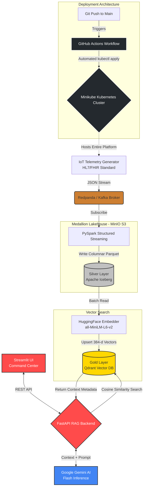

# 🏥 VitalPulse: Real-Time Clinical Lakehouse & RAG AI

            

**Author:** Harshith Bharathbhushan | Data & Analytics Engineer (May 2026 Grad)

## 📌 Executive Summary & Use Case
In modern healthcare, ICU telemetry data is generated at massive scale but remains isolated in rigid, unsearchable silos. **VitalPulse** bridges the gap between high-throughput streaming data and Generative AI. 

This project is an enterprise-grade, distributed Medallion Architecture deployed on Kubernetes. It ingests live patient vitals (3,500+ HL7/FHIR-compliant payloads/hour), detects physiological anomalies in real-time using PySpark, and stores them durably as ACID-compliant Parquet records in an Apache Iceberg Lakehouse. To make this data actionable, a highly constrained Retrieval-Augmented Generation (RAG) pipeline is layered on top, allowing clinicians to query live patient anomalies using natural language *without* the risk of AI hallucination.

## 🏗️ Pipeline Architecture & Data Flow



## 🧠 Business Logic & Data Modeling

The architecture strictly follows the Medallion Data Design pattern to ensure data quality and downstream AI safety.

* **Bronze Layer (Ingestion):** High-velocity, raw JSON payloads representing patient vitals (Heart Rate, Blood Pressure, SpO2) are published directly to a Redpanda (Kafka) topic by simulated IoT edge devices.
* **Silver Layer (Validation & Storage):** PySpark Structured Streaming consumes the Kafka topic, enforces strict schemas to prevent data corruption, and applies physiological business logic to flag anomalies (e.g., Tachycardia where `HR > 100`, Hypoxemia where `SpO2 < 90`). Validated anomalies are appended to an Apache Iceberg table backed by MinIO object storage, ensuring ACID compliance.
* **Gold Layer (Semantic Vectors):** A Python orchestration script extracts the Iceberg records, translates the clinical text into 384-dimensional dense vectors using a local HuggingFace CPU model, and upserts them into Qdrant. The original Iceberg data is appended as a metadata payload.

## ⚙️ Key Engineering Challenges Conquered

1. **Eliminating LLM Hallucinations via Strict RAG Limits:**
* *Challenge:* Foundational LLMs will confidently invent patient data if they lack context.
* *Solution:* Engineered a decoupled FastAPI backend with a "Closed-Book" prompt structure. The AI is forced to read only the Qdrant payloads. If a user queries an anomaly not present in the vector search (e.g., querying "Hypoxemia" when the Top-K limit only retrieved "Tachycardia"), the system is programmed to gracefully degrade and respond: *"I don't have enough data to answer that."*


2. **The Context Window & Top-K Vector Bottleneck:**
* *Challenge:* Initial multi-condition queries failed because the Qdrant similarity search (`limit=5`) saturated the context window with the most frequent anomalies, leaving out rarer conditions.
* *Solution:* Expanded the vector retrieval limit and optimized the payload extraction loop, giving the Gemini model a wider semantic net to analyze complex, multi-variable clinical questions.


3. **Dependency Rot & Namespace Collisions:**
* *Challenge:* Mid-development, major vendor API deprecations occurred (Qdrant's `.search()` to `.query_points()` and Google's SDK migration to `google-genai`), causing global Python namespace collisions.
* *Solution:* Executed targeted virtual environment rebuilds, refactored legacy syntax to modern standards, and established strict dependency boundaries.


## 🚀 Execution & Automation Proof

This entire architecture runs on a local, containerized Kubernetes environment.

**1. Spin up the Distributed Infrastructure**

```bash
minikube start
kubectl apply -f infra/redpanda-broker.yaml
kubectl apply -f infra/minio.yaml
kubectl apply -f infra/qdrant.yaml

```

**2. Open the Network Bridges (Run in separate terminals)**

```bash
kubectl port-forward svc/kafka-service 29092:29092
kubectl port-forward svc/minio 9000:9000 9001:9001
kubectl port-forward svc/qdrant-service 6333:6333

```


### 🪣 Initializing the Data Lake (First Run Only)
Because this infrastructure is fully ephemeral, a fresh Kubernetes deployment starts with a blank storage drive. You must initialize the MinIO bucket before starting the PySpark streams.

1. **Login to MinIO:**
Open `http://localhost:9001` in your browser and log in with the local development credentials:
* **Username:** `admin`
* **Password:** `password123`


2. **Provision the Bucket:**
Click **Create Bucket** and name it exactly: `vital-pulse-lakehouse`


### 🌐 Localhost Port Map
Once the cluster is running and the port-forward commands are executed, you can access the various microservices at the following local endpoints:

* **Streamlit UI (Frontend):** `http://localhost:8501`
  * *The main command center for medical AI queries.*
* **FastAPI Swagger Docs (Backend):** `http://localhost:8000/docs`
  * *Interactive REST API documentation and direct endpoint testing.*
* **MinIO Console (Data Lake):** `http://localhost:9001`
  * *Visual access to the Apache Iceberg Parquet files. (Login: admin / password123)*
* **Qdrant Dashboard (Vector DB):** `http://localhost:6333/dashboard`
  * *Visual interface to inspect the 384-dimensional clinical vector embeddings.*


**3. Ignite the Streaming Pipeline**

```bash
# Terminal A: Start generating simulated IoT telemetry
python stream_vitals.py 

# Terminal B: Submit the PySpark anomaly detection job
kubectl apply -f infra/spark-job.yaml

# Terminal C: Watch the Spark engine process data in real-time
kubectl logs -f job/spark-anomaly-detector

# Terminal D: Once data populates, vectorize the Iceberg records into Qdrant
python vectorize_anomalies.py 

```

**4. Boot the AI Serving Layer**

```bash
# Terminal E: Start the FastAPI backend
uvicorn rag_api:app --port 8000

# Terminal F: Launch the Streamlit interactive dashboard
streamlit run dashboard.py 

```

**5. Graceful Teardown (Windows/PowerShell)**
To safely spin down the infrastructure and wipe the Persistent Volume Claims (freeing up disk space), run the teardown script:
```bash
.\teardown.ps1

```

## 🔗 Connect

Designed and developed by Harshith Bharathbhushan.

* **LinkedIn:** [Harshith Bharathbhushan](https://www.linkedin.com/in/harshithbhushan/)
* **Portfolio:** [github.com/harshithbhushan](https://github.com/harshithbhushan)
